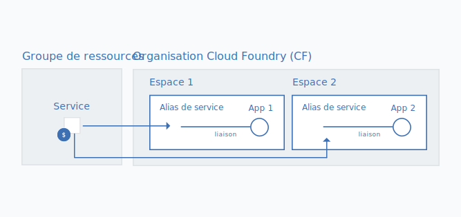
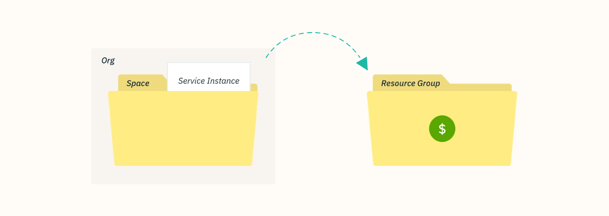

---

copyright:

  years: 2017, 2018

lastupdated: "2018-07-16"

---

{:shortdesc: .shortdesc}
{:codeblock: .codeblock}
{:screen: .screen}
{:new_window: target="_blank"}
{:gif: data-image-type='gif'}
{:tip: .tip}

# Migration d'applications et d'instances de service Cloud Foundry dans un groupe de ressources
{: #migrate}

Pour que l'utilisation d'{{site.data.keyword.Bluemix}} soit plus simple et plus flexible, nous avons inclus des [groupes de ressources](/docs/resources/resourcegroups.html#rgs), dont le concept est similaire à celui des espaces Cloud Foundry. Toutefois, les groupes de ressources offrent plusieurs avantages supplémentaires, comme un contrôle d'accès à granularité fine via l'utilisation d'IBM Cloud Identity and Access Management (IAM), la possibilité de connecter des instances de service à des applications et des services de différentes régions ainsi qu'un affichage de l'utilisation par groupe.
{:shortdesc}

Nous déplaçons les services depuis Cloud Foundry pour bénéficier des avantages des groupes de ressources. Ce qui signifie que lorsque vous voyez l'icône de  en regard d'un de vos services dans le tableau de bord, vous devez commencer un plan de migration pour que vos instances de service ou vos applications créées via [{{site.data.keyword.Bluemix_notm}} {{site.data.keyword.dev_console}}](https://console-demo3.bluemix.net/docs/apps/index.html#create) soient déplacées de leur espace et organisation Cloud Foundry en cours dans un groupe de ressources. Tant qu'un service {{site.data.keyword.Bluemix_notm}} utilise des rôles, des espaces et des organisations Cloud Foundry et non IAM et des groupes de ressources, vous ne pouvez pas migrer vos instances de service Cloud Foundry existantes dans un groupe de ressources.

Lorsque vous faites migrer des instances de service Cloud Foundry ou des applications {{site.data.keyword.dev_console}} vers un groupe de ressources, le groupe que vous choisissez ne peut pas être modifié une fois la migration terminée. Par conséquent, vous devez prendre soin de planifier la façon dont vous souhaitez organiser les ressources dans le compte avant de procéder à la migration. Cela peut signifier que vous devez créer un ou plusieurs groupes de ressources, si vous disposez d'un compte facturable, avant de procéder à la migration. 

Vous pouvez essayer d'organiser vos ressources dans des groupes de ressources de la même façon que vous avez organisé vos ressources dans des espaces Cloud Foundry. Pour plus d'informations sur l'utilisation des groupes de ressources, voir [Meilleures pratiques en matière d'organisation des ressources dans un groupe de ressources](/docs/resources/bestpractice_rgs.html#bp_resourcegroups).
{: tip}

## Pourquoi migrer ?

### Instances de service Cloud Foundry

Les services prenant en charge le contrôle d'accès Cloud IAM et l'organisation dans des groupes de ressources offrent plusieurs avantages :

* En utilisant le contrôle d'accès à granularité fine, vous pouvez définir l'accès à des instances de service individuelles ou à un groupe de ressources. 
* En utilisant des groupes d'accès et de groupes de ressources pour organiser des utilisateurs et des ressources, vous définissez uniquement le nombre minimal de règles d'accès. Par exemple, si vous souhaitez que tous les développeurs d'un groupe aient accès aux ressources d'un environnement de développement, vous pouvez organiser tous ces utilisateurs dans un groupe d'accès de développeur puis ajouter toutes les ressources auxquelles ils ont besoin d'accéder dans un groupe de ressources. Vous pouvez ensuite définir une règle pour que le groupe d'accès ait accès à toutes les ressources du groupe de ressources.
* Vous pouvez afficher l'utilisation par groupe de ressources de la même manière que vous affichiez l'utilisation par organisations Cloud Foundry.
* Vous pouvez vous connecter à des applications et des services dans tout espace Cloud Foundry, ce qui permet des connexions pour les applications et les services de différentes régions. Lorsque vous effectuez une migration, la connexion est établie automatiquement par la transformation de votre instance de service Cloud Foundry initiale en un alias et par la création d'une instance liée dans un groupe de ressources de votre choix. Le graphique suivant présente comment fonctionne la connexion à l'aide d'un alias.

### {{site.data.keyword.dev_console}}apps

Précédemment, les applications {{site.data.keyword.dev_console}} pouvaient être associées uniquement aux instances de service Cloud Foundry. Désormais, si vous faites migrer vos applications vers un groupe de ressources, vous pouvez associer vos applications à des instances de service faisant partie d'un groupe de ressources et prenant en charge le contrôle d'accès Cloud IAM. 

## Qui peut effectuer la migration ?
{: #whocanmigrate}

### Accès requis pour les instances de service 

Les utilisateurs doivent posséder des droits d'accès spécifiques pour faire migrer des instances de service Cloud Foundry vers un groupe de ressources :

* Un utilisateur doit posséder le rôle de développeur sur l'espace Cloud Foundry ou le rôle de responsable sur l'organisation à laquelle l'instance appartient.
* Un utilisateur doit posséder au minimum le rôle IAM Afficheur pour gérer le groupe de ressources vers lequel l'instance va être migrée.
* Un utilisateur doit posséder au minimum le rôle IAM Editeur pour le service.

Pour plus d'informations sur l'affectation des droits d'accès appropriés, voir [Accès Cloud Foundry](/docs/iam/cfaccess.html#cfaccess) et [Accès IAM](/docs/iam/users_roles.html#platformrolestable).

Pour vérifier les droits d'accès dont vous disposez, cliquez sur **Gérer** &gt; **Sécurité** &gt; **Identity and Access** dans la barre de menus de la console puis cliquez sur **Utilisateurs**. Cliquez sur votre nom et passez en revue vos **règles d'accès** pour les rôles IAM affectés et les **droits d'accès Cloud Foundry** afin de voir les organisations auxquelles vous avez accès, ainsi que les rôles Cloud Foundry qui vous sont affectés.
{: tip}

### Accès requis pour les applications {{site.data.keyword.dev_console}}

Tout utilisateur pouvant accéder à une application {{site.data.keyword.dev_console}} peut migrer cette dernière. Toutefois, la migration d'une application ne migre pas les services qui lui sont associés. Les instances de service doivent être migrées séparément.

## Comment fonctionne la migration ?

### Migrations d'instances de service

Lors de la migration d'une instance de service depuis une organisation et un espace Cloud Foundry vers un groupe de ressources, une nouvelle instance de service liée est créée dans le groupe de ressources. L'instance d'origine dans l'organisation et l'espace Cloud Foundry se transforme en [alias](/docs/resources/connecting_apps.html#what_is_alias). L'alias est pris en compte dans le quota de votre organisation, mais vous êtes facturé pour l'utilisation de l'instance de service dans le groupe de ressources.

{: gif}

Les instances de service sont migrées l'une après l'autre lorsque vous recevez une notification sur le tableau de bord sous la forme d'une icône de  associée à votre instance de service Cloud Foundry.

Avant de commencer le processus de migration, consultez la documentation du produit pour voir s'il existe des modifications supplémentaires spécifiques au service à effectuer lors de la migration de votre instance de service vers un groupe de ressources. Par exemple, il peut être nécessaire de migrer des données d'anciennes instances vers de nouvelles instances ou de mettre à jour les données d'identification utilisées pour votre application si vous supprimez l'alias Cloud Foundry. Les applications appelant directement l'API d'un service ayant été migré doivent mettre à jour l'appel d'API afin d'utiliser soit une clé d'API IAM, soit un jeton d'accès.
{: tip}

1. Ouvrez le menu **Plus d'actions**.
2. Sélectionnez **Migration vers un groupe de ressources** pour démarrer.
3. Sélectionnez un groupe de ressources.
4. Cliquez sur **Migrer** ; la migration de l'instance est effectuée pour vous.
5. Puisque vous ne pouvez faire migrer qu'une seule instance à la fois, vous pouvez continuer de faire migrer des instances éligibles une fois que la première instance a été migrée.

Une fois que vous avez correctement fait migré une instance, elle apparaît dans la section Services de votre tableau de bord. L'alias demeure dans la section Cloud Foundry du tableau de bord. Vous pouvez utiliser l' dans la section Cloud Foundry du tableau de bord pour identifier les alias.

### Migration des applications {{site.data.keyword.dev_console}}

Les migrations sont migrées l'une après l'autre en cliquant sur l'icône de  associée à chaque entrée de la vue Liste des applications.

1. Sélectionnez l'icône **Menu**  puis sélectionnez le portail de développeur qui vous intéresse (Watson, Mobile ou Web Apps, par exemple).
2. Sélectionnez **Applications**. Les listes **Applications (Action requise)** et **Applications (Migrées)** s'affichent alors.
3. Pour chaque entrée de la liste **Applications (Action requise)**, cliquez sur l'icône **Migrer** .
4. Sélectionnez ou créez un groupe de ressources.
5. Cliquez sur **Migrer**. L'application est alors migrée pour vous.
6. Confirmez que l'application apparaît désormais dans la liste **Applications (Migrées)**.
7. Puisque vous ne pouvez faire migrer qu'une seule application à la fois, vous pouvez continuer de faire migrer des applications éligibles une fois que la première application a été migrée.

## Etapes suivantes

Une fois que vous avez migré vos instances de service Cloud Foundry dans un groupe de ressources, vous devez vérifier que les utilisateurs de votre compte disposent du niveau d'accès requis pour les ressources des groupes de ressources de compte. Vous pouvez également fournir un accès permettant de gérer le groupe de ressources, de telle sorte que les utilisateurs puissent créer de nouvelles instances de service dans les groupes de ressources de compte.

Pour plus d'informations sur l'affectation de l'accès aux ressources de vos groupes de ressources, voir [Affectation de l'accès à des groupes de ressources et aux ressources s'y trouvant](/docs/resources/bestpractice_rgs.html#assigning-access-to-resource-groups-and-the-resources-within-them).

Consultez également la documentation du service afin de voir s'il est nécessaire d'effectuer des mises à jour pour vos applications existantes une fois la migration terminée. 

## Traitement des incidents

Si vous rencontrez des problèmes lors de la migration d'instances de service Cloud Foundry, consultez la rubrique [Traitement des incidents liés à la migration d'instances de service](/docs/resources/ts_migration.html).
